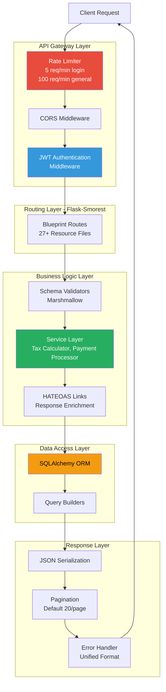
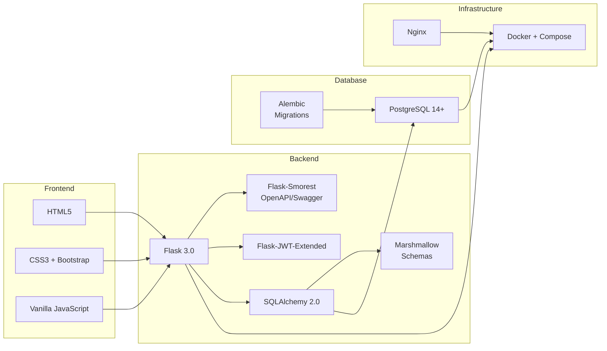
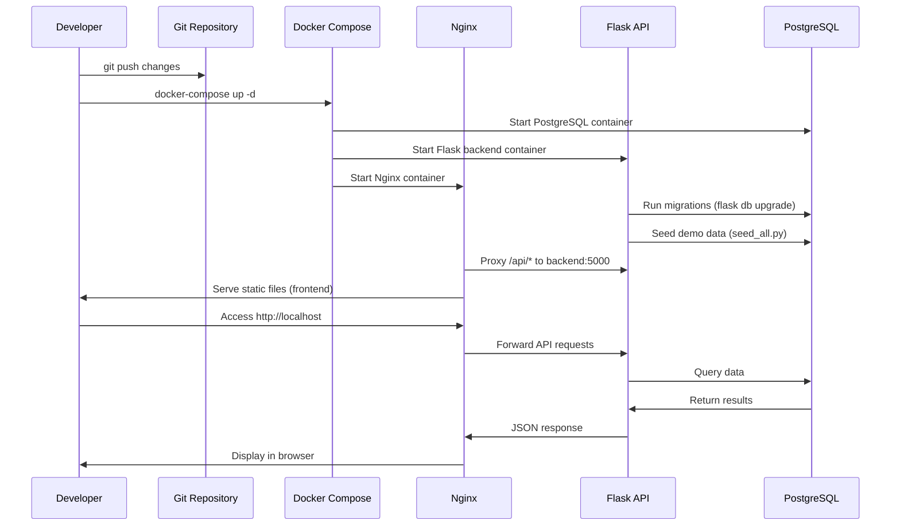
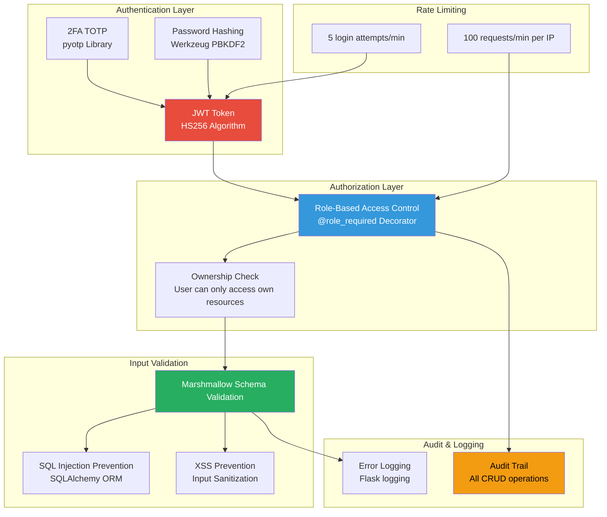
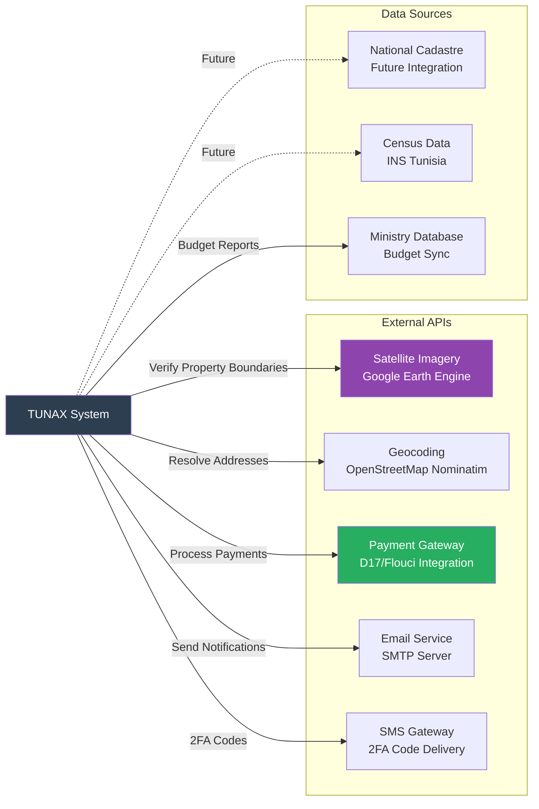

# TUNAX -  Diagrams

## DIAGRAM 1: System Architecture

```mermaid
graph TB
    subgraph "Client Layer"
        WEB[Web Browser]
        MOBILE[Mobile Browser]
    end
    
    subgraph "Presentation Layer"
        FE_DASH[Dashboard HTML/JS]
        FE_LOGIN[Login Pages]
        FE_FORMS[Form Components]
        FE_UPLOAD[Document Upload]
    end
    
    subgraph "Reverse Proxy"
        NGINX[Nginx<br/>Port 80/443]
    end
    
    subgraph "Application Layer - Docker Container"
        API[Flask REST API<br/>Port 5000]
        
        subgraph "Core Services"
            AUTH[Authentication Service<br/>JWT + 2FA]
            TAX[Tax Calculator Service]
            PAYMENT[Payment Service]
            INSPECTION[Inspection Service]
            PERMIT[Permit Service]
        end
        
        subgraph "Background Tasks"
            PENALTY[Penalty Calculator<br/>Scheduler]
            NOTIF[Notification Service]
            AUDIT[Audit Logger]
        end
    end
    
    subgraph "Data Layer - Docker Container"
        DB[(PostgreSQL<br/>Database)]
        CACHE[(Redis Cache<br/>Optional)]
    end
    
    subgraph "Storage Layer"
        FILES[File Storage<br/>/storage/documents]
        LOGS[Application Logs<br/>/logs]
    end
    
    subgraph "External Services"
        SAT[Satellite Imagery API<br/>Google Earth Engine]
        GEO[Geolocation API<br/>OpenStreetMap]
        PAY_GW[Payment Gateway<br/>D17/Flouci]
        EMAIL[Email Service<br/>SMTP]
        SMS[SMS Gateway<br/>2FA Codes]
    end
    
    WEB --> NGINX
    MOBILE --> NGINX
    NGINX --> FE_DASH
    NGINX --> FE_LOGIN
    NGINX --> FE_FORMS
    NGINX --> FE_UPLOAD
    
    FE_DASH --> API
    FE_LOGIN --> API
    FE_FORMS --> API
    FE_UPLOAD --> API
    
    API --> AUTH
    API --> TAX
    API --> PAYMENT
    API --> INSPECTION
    API --> PERMIT
    
    AUTH --> DB
    TAX --> DB
    PAYMENT --> DB
    INSPECTION --> DB
    PERMIT --> DB
    
    PENALTY --> DB
    NOTIF --> DB
    AUDIT --> DB
    
    API --> FILES
    API --> LOGS
    
    INSPECTION --> SAT
    API --> GEO
    PAYMENT --> PAY_GW
    NOTIF --> EMAIL
    AUTH --> SMS
    
    DB -.->|Backup| FILES
    
    style API fill:#4A90E2
    style DB fill:#50C878
    style NGINX fill:#F39C12
    style AUTH fill:#E74C3C
    style SAT fill:#9B59B6
    style PAY_GW fill:#1ABC9C
```

---

## DIAGRAM 2: User Roles & Permissions Hierarchy

```mermaid
graph TD
    subgraph "Ministry Level - Highest Authority"
        MINISTRY[👑 MINISTRY<br/>National Oversight]
    end
    
    subgraph "Municipal Level - Administrative"
        ADMIN[🏛️ MUNICIPAL_ADMIN<br/>Commune Administrator]
        FINANCE[💰 FINANCE<br/>Treasury Officer]
        CONTENT[⚖️ CONTENTIEUX<br/>Legal/Disputes]
        URBAN[🏗️ URBANISM<br/>Planning Officer]
        INSPECT[🔍 INSPECTOR<br/>Field Verification]
        AGENT[👔 AGENT<br/>Front Desk Support]
    end
    
    subgraph "Public Level - Taxpayers"
        CITIZEN[🏠 CITIZEN<br/>Individual Property Owner]
        BUSINESS[🏢 BUSINESS<br/>Land/Business Owner]
    end
    
    MINISTRY -->|Oversees All| ADMIN
    MINISTRY -->|Budget Approval| FINANCE
    MINISTRY -->|National Reports| CONTENT
    
    ADMIN -->|Manages| FINANCE
    ADMIN -->|Manages| CONTENT
    ADMIN -->|Manages| URBAN
    ADMIN -->|Manages| INSPECT
    ADMIN -->|Manages| AGENT
    
    AGENT -->|Assists| CITIZEN
    AGENT -->|Assists| BUSINESS
    
    INSPECT -->|Verifies| CITIZEN
    INSPECT -->|Verifies| BUSINESS
    
    URBAN -->|Reviews Permits| CITIZEN
    URBAN -->|Reviews Permits| BUSINESS
    
    FINANCE -->|Processes Payments| CITIZEN
    FINANCE -->|Processes Payments| BUSINESS
    
    CONTENT -->|Resolves Disputes| CITIZEN
    CONTENT -->|Resolves Disputes| BUSINESS
    
    style MINISTRY fill:#8E44AD,color:#fff
    style ADMIN fill:#E74C3C,color:#fff
    style FINANCE fill:#F39C12,color:#000
    style CONTENT fill:#3498DB,color:#fff
    style URBAN fill:#1ABC9C,color:#fff
    style INSPECT fill:#95A5A6,color:#fff
    style AGENT fill:#34495E,color:#fff
    style CITIZEN fill:#27AE60,color:#fff
    style BUSINESS fill:#16A085,color:#fff
```

---

## DIAGRAM 3: API Architecture - Endpoints Overview

```mermaid
graph LR
    subgraph "Public Endpoints - No Auth"
        PUB_CALC[POST /public/calculator<br/>Tax Estimation]
        PUB_TARIFF[GET /public/tariffs<br/>Public Tariff Info]
        PUB_COMMUNE[GET /public/communes<br/>Commune List]
    end
    
    subgraph "Authentication Endpoints"
        AUTH_REG[POST /auth/register<br/>User Registration]
        AUTH_LOGIN[POST /auth/login<br/>JWT Token Generation]
        AUTH_ME[GET /auth/me<br/>Current User Profile]
        AUTH_2FA[POST /auth/2fa/setup<br/>Enable 2FA]
        AUTH_VERIFY[POST /auth/2fa/verify<br/>Verify TOTP Code]
    end
    
    subgraph "TIB - Property Tax Endpoints"
        TIB_LIST[GET /tib/properties<br/>List My Properties]
        TIB_CREATE[POST /tib/properties<br/>Declare Property]
        TIB_VIEW[GET /tib/properties/:id<br/>Property Details]
        TIB_UPDATE[PUT /tib/properties/:id<br/>Update Property]
        TIB_TAXES[GET /tib/my-taxes<br/>My Tax List + Penalties]
        TIB_CALC[POST /tib/calculate<br/>Calculate TIB Tax]
    end
    
    subgraph "TTNB - Land Tax Endpoints"
        TTNB_LIST[GET /ttnb/lands<br/>List My Lands]
        TTNB_CREATE[POST /ttnb/lands<br/>Declare Land]
        TTNB_VIEW[GET /ttnb/lands/:id<br/>Land Details]
        TTNB_TAXES[GET /ttnb/my-taxes<br/>Land Taxes]
        TTNB_CALC[POST /ttnb/calculate<br/>Calculate TTNB Tax]
    end
    
    subgraph "Payment Endpoints"
        PAY_PAY[POST /payments/pay<br/>Process Payment]
        PAY_HIST[GET /payments/history<br/>Payment History]
        PAY_RECEIPT[GET /payments/:id/receipt<br/>Download Receipt]
        PAY_ATTEST[GET /payments/:id/attestation<br/>Payment Attestation]
        PAY_PLAN[POST /payment-plans/request<br/>Installment Plan]
    end
    
    subgraph "Permit Endpoints"
        PERM_REQ[POST /permits/request<br/>Submit Permit Application]
        PERM_LIST[GET /permits<br/>My Permits]
        PERM_VIEW[GET /permits/:id<br/>Permit Status]
        PERM_REVIEW[PUT /permits/:id/review<br/>Approve/Reject<br/>🔒 URBANISM]
    end
    
    subgraph "Inspection Endpoints 🔒 INSPECTOR"
        INSP_CREATE[POST /inspector/inspections<br/>Create Inspection]
        INSP_LIST[GET /inspector/inspections<br/>My Inspections]
        INSP_SAT[POST /inspector/satellite-verify<br/>Satellite Comparison]
        INSP_SUBMIT[PUT /inspector/inspections/:id<br/>Submit Report]
    end
    
    subgraph "Finance Endpoints 🔒 FINANCE"
        FIN_DEBTORS[GET /finance/debtors<br/>Delinquent Taxpayers]
        FIN_REPORTS[GET /finance/reports<br/>Collection Reports]
        FIN_PROCESS[POST /finance/payments/:id/process<br/>Manual Payment]
    end
    
    subgraph "Dispute Endpoints"
        DISP_FILE[POST /disputes/file<br/>File Dispute]
        DISP_LIST[GET /disputes<br/>My Disputes]
        DISP_REVIEW[PUT /disputes/:id/resolve<br/>Resolve Dispute<br/>🔒 CONTENTIEUX]
    end
    
    subgraph "Municipal Admin Endpoints 🔒 ADMIN"
        ADM_DASH[GET /municipal/dashboard<br/>Admin Dashboard]
        ADM_CONFIG[PUT /municipal/config<br/>Update Services/Prices]
        ADM_USERS[GET /municipal/users<br/>Manage Users]
        ADM_PROPS[GET /municipal/properties<br/>All Properties]
    end
    
    subgraph "Ministry Endpoints 🔒 MINISTRY"
        MIN_DASH[GET /ministry/dashboard<br/>National Overview]
        MIN_BUDGET[POST /ministry/budgets/:id/vote<br/>Vote on Budget]
        MIN_REPORTS[GET /ministry/reports<br/>National Reports]
    end
    
    subgraph "Search & Reports"
        SEARCH_PROP[GET /search/properties<br/>Advanced Search]
        SEARCH_LAND[GET /search/lands<br/>Land Search]
        REPORT_EXP[GET /reports/export/properties<br/>Excel Export]
        REPORT_DEL[GET /reports/delinquency<br/>Late Payments]
    end
    
    style AUTH_LOGIN fill:#E74C3C,color:#fff
    style PAY_PAY fill:#27AE60,color:#fff
    style INSP_SAT fill:#3498DB,color:#fff
    style MIN_DASH fill:#8E44AD,color:#fff
    style ADM_DASH fill:#E67E22,color:#fff
```

---

## DIAGRAM 4: API Request Flow

---

## DIAGRAM 5: Technology Stack

---

## DIAGRAM 6: Deployment Flow

---

## DIAGRAM 7: Security Architecture

---

## DIAGRAM 8: System Integration Points

